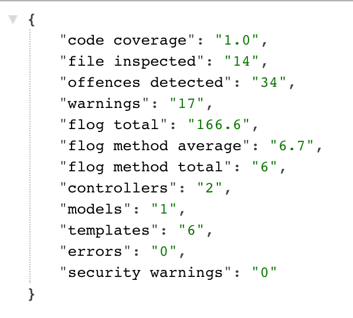

# Rails metrics sample project

## Tools used in metrics
* [SimpleCov](https://github.com/colszowka/simplecov)
  * Key metrics
    * % covered
    * Lines
    * Relevant Lines
    * Lines missed
* [Rubocop](https://github.com/bbatsov/rubocop)
  * Key metrics
    * Total file checked
    * Offences detected
* [Reek](https://github.com/troessner/reek)
  * Key metrics
    * total warnings
* [Flog](https://github.com/seattlerb/flog)
  * Key metrics
    * Flog total
    * Flog per method average
* [Brakeman](https://github.com/presidentbeef/brakeman)
  * Key metrics
    * Controllers
    * Models
    * Templates
    * Errors
    * Security Warnings

## Metrics selected
* SimpleCov
  * % covered
* Rubocop
  * n files inspected
  * n offences detected
* Reek
  * n total warnings
* Flog
  * n flog total
  * n flog average
  * n flog method total
* Brakeman
  * number of controllers
  * number of models
  * number of templates
  * number of errors
  * number of security warnings

## How to generate project metrics
* Run `ruby metrics/metrics_report.rb` in the project directory
* The metrics json file will be in `metrics/project_metrics.json`

## Sample metrics json

